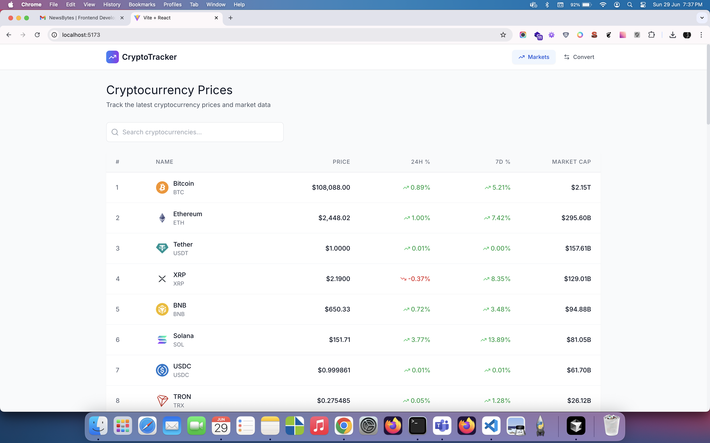
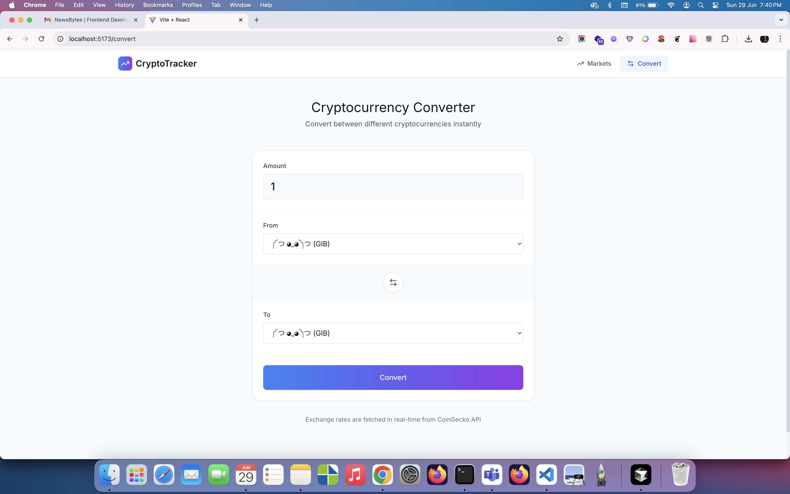

# CryptoTracker - Cryptocurrency Tracking App

A responsive, single-page cryptocurrency tracker and converter built with **React**, **Tailwind CSS**, **Framer Motion**, and **CoinGecko API**.

## Features

- Live crypto market data (top 20 coins)
- Current price, 24h % change, 7d % change, and coin logo
- Real-time crypto-to-crypto converter
- Mobile-first UI using Tailwind CSS
- Smooth animations via Framer Motion
- Routing via React Router DOM

## Architecture Choice & Reasoning

### ➤ SPA (Single Page Application)

- Fast navigation and no reloads
- Ideal for interactive and real-time UI

### ➤ React + Vite

- Vite provides blazing-fast dev experience
- React allows modular, reusable components

### ➤ Tailwind CSS

- Utility-first styling for responsive, consistent design
- Easy dark/light theming, animation, layout control

### ➤ Framer Motion

- Professional-grade animations with minimal effort
- Smooth transitions, hover effects, and animated result boxes

### ➤ CoinGecko API

- Free and reliable crypto market data
- No authentication key required

---

## Screenshots

| Homepage                        | Converter                               |
| ------------------------------- | --------------------------------------- |
|  |  |
